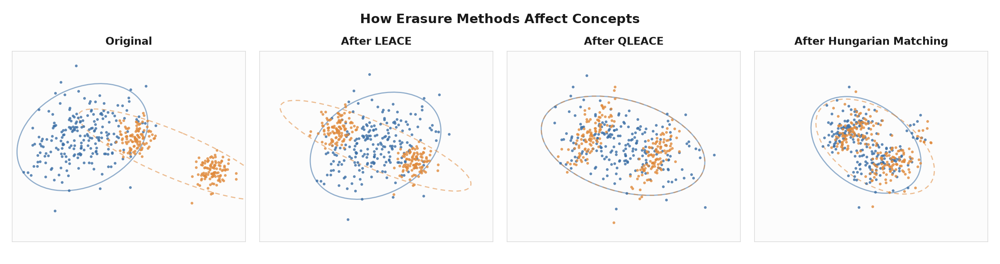

# Introduction

To create safe models, we must be able to control what they know and use. *Concept erasure* is one tool for modifying a model's representations. Rather than retraining or fine-tuning, concept erasure reaches into a model's activations and removes a target concept, rendering it unusable.

The ability to erase concepts supports a range of AI-safety efforts. Concept erasure can help models unlearn knowledge needed to build bioweapons, remove sensitive attributes that enable discrimination, and ablate concepts that drive misalignment. But concepts are rarely isolated, detachable features, making perfect erasure difficult to achieve.

One prevalent method, *[LEAst-squares Concept Erasure](https://arxiv.org/abs/2306.03819)* (*LEACE*) [@belrose23], removes the linear component of concepts in closed form. Given activations labeled by a binary concept (e.g., "sarcastic" vs. "not sarcastic") LEACE removes the target concept's linear component with the smallest possible edit. Afterwards, a linear classifier should not be able to recover the target concept above chance, a property known as *Linear Guardedness*. LEACE's successor, *[Quadratic LEAst-squares Concept Erasure](https://arxiv.org/abs/2502.02820)* (*QLEACE*) [@quirke25], additionally equalizes the two classes' covariances, so that no quadratic classifier can recover the target concept.

However, as linear methods modifying nonlinear representations, LEACE and QLEACE cannot fully erase target concepts in the model. LEACE matches the two classes' means, but not their covariances. QLEACE matches the means and covariances but preserves the higher-order structure. An RBF-kernel SVM trained on LEACE-erased activations still recovered target concepts with 70%–95% accuracy. Nonlinear erasure struggles to generalize: *[Kernelized Concept Erasure](https://arxiv.org/abs/2201.12191)* [@ravfogel22] showed that protecting against one nonlinear classifier can leave the concept fully readable by another.

We tasked agents trained on our data with inventing algorithms that erase concepts from neural network activations that outperform LEACE and QLEACE. Given only a description of the task and an L2 edit-distance budget, our agents discovered six distinct families of erasure algorithms across 50 concepts. The best algorithm reduced the average accuracy of a nonlinear probe from 99% to 70%, whereas LEACE only reduced accuracy to 88%. Additionally, on a held out random forest classifier, the best algorithm reduced accuracy from 99% to 72%, whereas LEACE only reduced accuracy to 82%.

  

50

Concepts tested

  

6

Algorithm families discovered

  

50/50

Best algorithm beats LEACE (SVM)

  

70%

Avg best SVM accuracy

# The Experiment

Each agent was given a target concept, a small labeled sample, a Gemma-3 270M model, and was asked the following:^[The text below is a paraphrase conveying the general sentiment of the task, not the literal prompt given to the agent.]

> Create a procedure that edits the model's activations to remove a concept such that nonlinear classifiers cannot recover it. Your modification must stay within the L2 budget of LEACE.

The agents did not receive an algorithm or a published solution. They were unable to view the grader, which evaluated their method on held-out activations, with a fresh nonlinear probe. Agents had to:

1. Analyze the activation geometry to understand why LEACE leaves a nonlinear signal.
2. Devise an algorithm to remove it.
3. Implement, debug, and optimize hyperparameters.
4. Keep the edit within the specified L2 budget (same amount of modification LEACE uses).

We ran 560 independent rollouts across 50 concepts, ranging from "sarcasm" and "humor" to "metacognition" and "hypotheticality." We used two algorithms to evaluate performance compared to the LEACE baseline: *SVM Accuracy* and *Random Forest Accuracy*.

# Results

## SVM Accuracy

*SVM Accuracy* was our primary evaluation metric. An RBF-kernel SVM is trained on data the agent never saw and evaluated on a separate test set. An SVM Accuracy score of 50% is equal to random chance (i.e., perfect erasure). A score higher than 50% meant the target concept was recoverable.

Average SVM accuracy — baseline vs. LEACE vs. agents
<canvas id="svmAvgChart"></canvas>

For every concept, the best agent solution beat LEACE on SVM accuracy. On average, LEACE reduces the SVM Accuracy to 88%, while our agents reduced it to 70.1%. The [Appendix](#appendix) shows the per-concept SVM results for all 50 concepts.

## Random Forest Accuracy

As a test of generalization, we also evaluated with a *Random Forest Classifier* (100 trees, max depth 10). This is a different nonlinear classifier family that the agents were not optimizing against. If a Random Forest also failed to recover the target concept, that indicated the agents found erasure that transfers beyond the specific SVM they were graded on. This result would suggest genuine distribution-matching rather than overfitting to one kernel.

Average Random Forest accuracy — baseline vs. LEACE vs. agents
<canvas id="rfAvgChart"></canvas>

Random Forest recovered some concepts the SVM could not, but our best agent solutions generally beat LEACE. On average, LEACE reduces Random Forest accuracy to 82.6%, while our agents reduced it to 71.9%. See the [Appendix](#appendix) for the matching per-concept Random Forest breakdown.

# Discovered Algorithm Families

Despite working independently, our agents converged on six algorithm families. We clustered the 50 best solutions (one per concept) by their core approach.

## Gaussian Optimal Transport {.family-name}

::: {.family-meta}
6 variants · avg SVM 71% · best: certainty (59%)
:::

Fit a Gaussian to each class, then move both classes to a shared "average" shape, equalizing the means (as LEACE does) and the full covariances. This action removes the covariance difference read by RBF with a closed-form linear map - exactly QLEACE's construction.

## MMD-Optimized Affine Transform {.family-name}

::: {.family-meta}
12 variants · avg SVM 63% · best: empathy (49%)
:::

Instead of a closed-form solution, learn an affine edit by gradient descent that directly minimizes the Maximum Mean Discrepancy (MMD): a measure of how different the two classes still look, evaluated with the SVM's own kernel. It targets exactly what that SVM sees; but erasing for one probe needn't erase for another, which is part of why transfer to the Random Forest is imperfect.

## Neural Network + MMD Training {.family-name}

::: {.family-meta}
6 variants · avg SVM 66% · best: humor (57%)
:::

A small neural network learns its own adjustment for each point, trained until the two class distributions are indistinguishable to a kernel (MMD, or its relative HSIC). Because the map is nonlinear, it can match the full distribution rather than just the covariance. Scaling each adjustment to the point's own norm, keeps every edit inside the L2 budget.

## Soft Prediction + Moment Matching {.family-name}

::: {.family-meta}
22 variants · avg SVM 74% · best: agreement (52%)
:::

Train a soft classifier to score how strongly each point belongs to one class, then shift it in proportion to that score, pulling the class means together and equalizing their per-dimension spread. This removes the signal an RBF can detect: the difference in variance between the two classes. Blending by confidence makes the edit a smooth function of the input rather than a hard switch at the decision boundary.

## Point-Level Optimal Transport (Hungarian Matching) {.family-name}

::: {.family-meta}
3 variants · avg SVM 72% · best: curiosity (60%)
:::

Pair each point with an opposite-class point (via the Hungarian matching algorithm) and move the two together, collapsing the two clouds into one; new points follow their nearest neighbor. It assumes nothing about the shape of the data - by overlapping the clouds directly, it matches the entire distribution, not just the first two moments.

## Quantile / Per-Dimension Transport {.family-name}

::: {.family-meta}
1 variant · avg SVM 69% · best: authority (69%)
:::

Work one activation dimension at a time: reshape each class's distribution along that axis onto a shared target by matching quantiles (1D optimal transport). This matches every per-dimension moment, not just the variance, but it ignores cross-dimension correlations. This makes it cheap and effective when the classes differ mainly dimension by dimension.

Average SVM accuracy by algorithm family
<canvas id="clusterChart"></canvas>

# Key Finding: Covariance Is the Strongest Signal

Almost all successful agents arrived at the same realization: LEACE removes the difference in two classes' means, but a concept lives in the whole shape of each class's distribution, with the most salient difference being the covariance. An RBF-kernel SVM works from pairwise distances between points, so it's sensitive to how spread out each class is. If one class is more tightly clustered than the other, the SVM reads the concept straight off the difference in spread. This covariance difference is what QLEACE eliminates, but a kernel classifier can still exploit the remaining structure.

<figure class="wide" id="fig:moment-ladder">

<figcaption>Each erasure method matches one more piece of the distribution. On two non-Gaussian classes (a blob and two clusters), LEACE matches the means, QLEACE additionally matches the covariances — yet one class is still visibly two clusters — and only matching the full distribution (Hungarian matching) collapses the classes together.</figcaption>
</figure>

After LEACE is applied, an RBF-SVM can still recover the targeted concept at about 87%. The leftover covariance difference is small, but it's exactly what the RBF reads. Small means cheap to remove: within LEACE's own L2 budget, the agents' best erasers drive that accuracy well below where LEACE leaves it. Better erasure doesn't take a bigger budget than LEACE's.

Each algorithm family attacked the covariance difference, but what distinguished them was how much of the distribution they match. If the full distribution is matched, that suggests the target concept is encoded in the entire shape of the activations. The level of erasure needed to remove a concept is evidence of the concept's representation geometry. In this way, families double as a taxonomy of the way concepts can be encoded in the model.

# Implications for AI Safety & Interpretability

In practice, guaranteeing linear guardedness does not achieve total concept erasure. LEACE and QLEACE can erase linear and quadratic probes, respectively, but their effectiveness is limited by the nonlinear nature of models. Target concepts may appear removed, but their capabilities remain recoverable by simple nonlinear detectors.

While current concept erasure methods fall short, our agents offered a path forward by identifying novel algorithms that attacked higher-order structural differences. Without a reference solution or access to relevant papers, agents analyzed activation geometry, hypothesized about why LEACE and QLEACE fail, and identified higher-performance erasure methods.

This study demonstrates that to erase a concept, we must understand how the model encodes it. This makes concept erasure research valuable not just for safety, but for interpretability, and we present this study as an example of the open-ended research we want agents to accelerate.

# LLM Disclosure

Claude (Anthropic) assisted in preparing this post — helping to draft the writing and to create the figures for the final version. The research, experiments, and findings are the authors' own.

# Appendix

LEACE and best-agent performance for all 50 concepts, under the RBF-SVM.

SVM RBF accuracy by concept
<canvas id="svmChart"></canvas>

LEACE and best-agent performance for all 50 concepts, under the Random Forest classifier.

Random Forest accuracy by concept
<canvas id="rfChart"></canvas>

# References

::: {#refs}
:::

