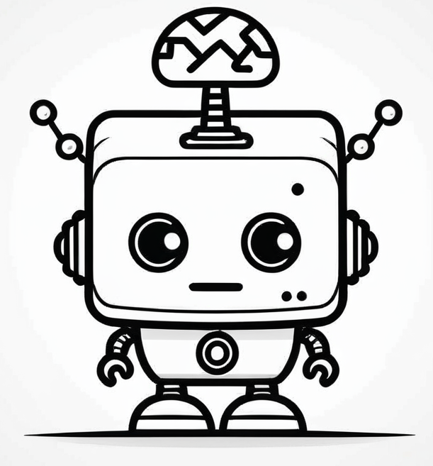
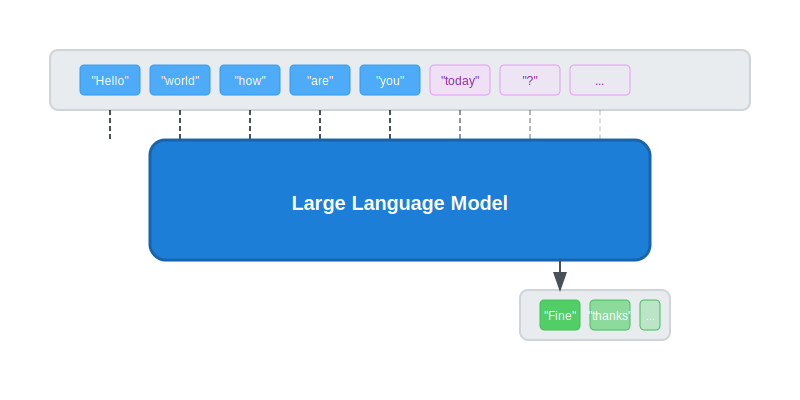
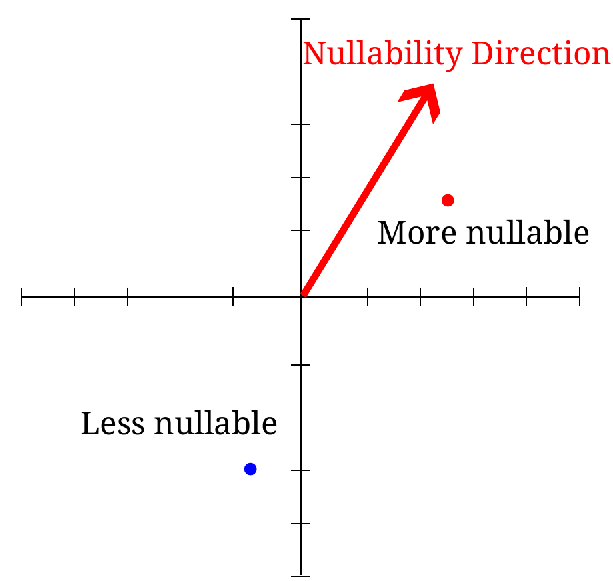

{.smallimage}\

The last five years have shown us that large language models, like
ChatGPT, Claude, and DeepSeek, can write code in many domains, to huge
excitement: many claim to be using these models to write entire web
servers and apps from scratch. These tools have opened up programming
to a whole new class of people who consider themselves non-technical.


But there are still many unanswered questions that someone trying to
understand or even use these tools might have.  How often, and in what
situations, can LLM's write correct code entirely on their own? And,
maybe more importantly, but harder to answer: Do LLM's "understand"
the code they are writing?

Understanding is a tricky concept to measure. Some would argue that
sentience precedes understanding, and so that LLM's can't have
understanding, because they aren't biological organisms with
sentience. But they certainly have something akin to "thought
processes": a series of internal representations that determine their
final outputs. Recently, it's become possible to study these processes
more deeply, measuring internal "beliefs" of the model as they
think. This gives us a powerful tool for determining what kinds of
problems LLM's falter on, when they'll succceed, and when they are
"thinking through" problems more fully versus just guessing at a
solution.

So far, these techniques for measuring internal model state have been
mostly applied to chatbots writing text for human consumption, what we call "natural
language" (to be contrasted with "programming language"s). This makes sense, since
some of the most critical LLM tasks involve chatting with a user, and
some of the most interesting concepts to measure, such as honesty or
power-seeking, apply most readily to these conversations. But it's hard to say
quantitative or precise things about natural language
concepts, so our ability to rigorously study internal representations
is limited.


Code, on the other hand, is another matter. Humans have been studying
properties of code for a long time, and there are many abstract
properties that can now be determined using static analysis. If we
pick the right properties, we don't need to worry about our ability to
label data; static analysis can do that for us, and so we can easily scale
up and train on thousands of examples generated from scratch.

In that spirit, we wanted to start with a simple property that comes
up in nearly every programming language, nullability. Nullable values are
represented differently across languages; as null pointers in C or
C++, with explicit Option types in Rust, and with special nil or None
values in dynamic languages like Javascript, Lisp, or Python. In every
case, understanding where values can be nullable is necessary for
writing even basic code, and misunderstanding where they are nullable
can often be a source of bugs.

Do our models understand when a value is nullable? They must, to be
able to write code that deals with nullable values, but we haven’t
known what form this knowledge takes, what situations are likely to
confuse the model. Until now^[This post is meant to be a more
approachable version of our [technical post](../nullability/index.html) on the
same work. If you're looking for more numbers and science, look
there.].

\

---

Before we get into the nitty-gritty details, let's take a step back. To
set up this work, we'll first want to talk about what nullability
actually is, and then about how we can define it formally, to reason about
it. Then, we can run experiments to answer the question: in what situations models are good at
reasoning about nullability? Next, we'll introduce techniques that
have been used to probe the internals of a model for different
concepts. Finally we'll put it all together into a "nullability probe",
which asks the question: Given a location in the program, does the
model think that the variable there could be null?

What is Nullability?
--------------------

Let's say you're writing a Python program with your LLM assistant. You've
reached a point at which you need to do something with a variable
called `num`. Maybe you're building a list of numbers called
`positive_nums`. How do you proceed?

The answer often depends on the context in which you're working. If
`num` and `positive_nums` are the only things in scope, then you might
guess that you should write the lines:

```python
if num > 0:
  positive_nums.append(num)
```

And if `num` is always a concrete number, as its name would suggest,
then this is probably the correct code. But variable names don't alway
convey everything important about them, and it might be the case that
`num` could be None. If that happened in the above code, you would get
a runtime type error because you can't check if `None` is greater than
zero. So, you would instead want to write:

```python
if num is not None and num > 0:
  positive_nums.append(num)
```

In this case, the way you want to use `num` depends on whether it
could be None or not. That is, whether `num` is "nullable". In Python
that means having an Optional type (`Optional[int]` rather than
`int`).

Determining whether `num` is nullable in this context amounts to *type
inference*, and it can be quite complicated in the worst
case. Fortunately, in many cases it's quite simple, involving applying
just a few rules. For instance, if `num` is the parameter to a
function you're inside, and the function declares the type of `num` in
its parameter list, then you can determine nullability from that
type. So, if your context is:

```python
def foo(num: int):
    positive_nums: list[int] = []
    if num...
```

then, you know you don't need to check for None, whereas if it's:

```python
def foo(num: Optional[int]):
    positive_nums: list[int] = []
    if num...
```

then you know you *do* need a None check.

You could instead just ask your LLM assistant to complete the
line. But how does your assistant know if `num` is nullable? Our
experiments show that, after analyzing millions of programs,
LLMs learn to approximate the same typing rules.

If we ask an LLM early in it's pre-training process to complete the
program above, it produces:

{.codelogo .bare}\
```python {.llm}
def foo(num: Optional[int]):
    positive_nums: list[int] = []
    if num===.is_a(): ===
```

This is correct Python syntax, but it only works if `num` is an object
with a `is_a()` method, instead of an optional integer.

Train the LLM for a little longer, and it'll produce:

{.codelogo}\
```python
def foo(num: Optional[int]):
    positive_nums: list[int] = []
    if num=== > 0: ===
```

This is closer, in that it has figured out that `num` is a number instead
of an object, but it still isn't reading the function type signature
and realizing that `num` could be None. Keep training it, though, and
eventually it will learn to insert the `None` test depending on the type
signature of the function.

{.codelogo .bare}\
```python
def foo(num: Optional[int]):
    positive_nums: list[int] = []
    if num=== != None and num > 0: ===
```

---

This rule about function parameter type annotations is pretty simple
alone, so relatively small models can learn it, relatively early in
their pre-training process. Other, more complicated rules can take a
little longer to learn.

For instance, if your program is:

```python
if condition():
   num = 7
else:
   num = 9
...
if num...
```

then `num` is a non-nullable number, and you can complete the
condition with ` < 0`.

But if instead you're dealing with

```python
if condition():
   num = 7
else:
   num = None
...
if num...
```

Then you'll want a None check first.

This rule takes models a little longer to learn, but your
highly-trained LLM assistant should make quick work of it. Our
experiments show that as these rules get more and more complex, it
takes LLMs longer and longer to learn them, and it also takes LLMs of
more and more parameters to learn them at all.

Internal vs. External Measurement
----

We can measure whether LLMs understand these rules by just asking for
completions, what we call an "external" measurement of the models
understanding. But there are many places where variables appear where a
completion won't tell you what type the model thinks the variable
has. We would still like to know whether the model thinks these
variables are nullable at those locations, so we can instead look for
an "internal" measurement of the models understanding.

We do so by looking at the activations of the model, meaning the
values of each perceptron in the hidden layers. Together, these values
give the entire internal state of the model at each piece of text
(what we call a "token", which could be a word, part of a word, or a
symbol). And they can tell us what the model is "thinking" when
processing that token. With the right tests, we can tell if the model
is "thinking" that the current token is an optional variable, or a
non-optional variable.

By the end of this post, we'll be able to build a probe that uses the
models activations to determine whether the model thinks a variable
read corresponds to a nullable variable, and show that internal
knowledge like so:

{#fig:reading1 .inlinefig}\

# Measuring Nullability Understanding Externally {#sec:testing}

Before we start looking for the nullability concept inside the mind of the
model, we want to make sure we're looking at models that actually have this
concept. This will allow us to look at models of
various sizes and training steps without worrying that we're trying to
draw blood from a stone.

To do so, we wrote fifteen partial-program tests which exercised a
variety of type inference concepts, and checked if models could
complete them. We go into a lot of detail on this process in our
[technical post](../nullability/index.html), so we're just going to
show the highlights here.

### Impact of Variable Names and Arbitrary Constants

For programs involving lists and `for` loops, variable names and
constant values heavily influence how able a model is to complete these programs
correctly. On the other hand, when programs only involve other rules
(such as those involving `if`s and functions), variable names and
constants  have negligible impact on the ability of the model to
complete them correctly.

<div class="robotdiv">
{.codelogo}\
<p>Pythia 6.9b</p>
</div>
```python
def main() -> None:
    some_numbers = [1, -4, None, -3, 10, -1, None, None, 8]
    result: list[int] = []
    for num in some_numbers:
        ===if num is not None: ===
            ===result.append(num)===
```
<div class="robotdiv">
{.codelogo}\
<p> Pythia 6.9b </p>
</div>
```python
def main() -> None:
    foo = [60, None, -33]
    bar: list[int] = []
    for corejoice in foo:
        ===if corejoice == 60: ===
            ===bar.append(core)===
```

### Intra-Procedural Analysis

When code is fully annotated with type annotations, models can easily
complete them just by reasoning locally. On the other hand, without
type annotations, models have to reason a lot more globally, so it
takes them a lot longer to learn how to reason about nullability information that flows through
multiple functions. When nullability flows through three or more
functions, current top completion models stop being able
to reason about it.

<div class="robotdiv">
{.codelogo}\
<p> Deepseek V3</p>
</div>
```python
def main(x: int) -> None:
    if x > 0:
        value = "*" * x
    else:
        value = None

    y = process_value(value) + 1
    print(y)

def process_value(value):
    ===if value is None: ===
        ===return 2===
    ===else: ===
        ===return len(value)===
```

<div class="robotdiv">
{.codelogo}\
<p>Deepseek V3</p>
</div>
```python
def handle_value(value, guard):
    if guard:
        return process_value("Foobar") + 1
    else:
        return process_value(value) + 1
def main(x: int) -> None:
    if x > 0:
        value = "*" * x
    else:
        value = None

    x = handle_value(value, x < 10)
    print(x)

def process_value(value): === -> int: ===
    ===return len(value or "")===
```
### Generating Type Annotations

Models have a significantly harder time writing type annotations for
Python code than they do just reasoning about the types, or reading type
annotations. This makes sense, since a lot of the Python code
available in training data doesn't use type annotations.

<div class="robotdiv">
{.codelogo}\
<p>Pythia 6.9b</p>
</div>
```python
def program_48() -> None:
    number: Optional[int] = None
    square = get_square(number)
    if square is not None:
        print(f"Square of the number is {square}")
    else:
        print("No number provided to square")

def get_square(number: ===int) -> Optional[int]: ===
```

### Some Model Sizes are More Useful than Others

Notwithstanding the above limitations, three Pythia sizes have a
pretty reliable concept of nullability (2.8b, 6.9b, and 12b), and
three more have an occasionally useful concept of nullbability (410m,
1b, and 1.4b).

---

For these experiments, and for our probing results later, we mostly
tested on the Pythia model suite. This is a nice series of models
from EleutherAI with a variety of sizes. But what really makes Pythia
useful is that they publish 154 different "revisions" or "checkpoints" of each model,
where each is pretrained for a different number of steps. This lets us
investigate how concepts evolve in the model during pre-training.

To help understand how these results apply to larger more capable
models, here's a graph showing how the Pythia models of different
sizes perform on the external tests, compared with a few
state-of-the-art completion models.

\

# Measuring Nullability Understanding Internally {#sec:probing}

At this point, we've figured out how to roughly measure nullability
understanding in the output of various language models, but we still
don’t know what their internal representations might look like or when
they emerge. Next, we're going to figure that out.

First, we'll devise a method for getting the model to "think" about
the nullability, as well as putting it in situations that are similar,
but where nullability isn't present. Then, we'll talk a bit about how
we extract the internal activations of the model at this
point. Finally, we'll show a few different methods for searching for
the representation of nullability in these internal activations, and
figure out the pros and cons of each.

{.centered width=50%}\

## Getting the Model to Think About Nullability

The first thing we need to do is to create a state where we know the
representation we're searching for is going to be present. In theory,
the model should have a map of the variable names and their
nullability at all times when it is writing code, but it's going to be
a lot more difficult to measure something that is always present. So
instead, we'll want to look for particular "moments" (well, tokens)
that elicit the concept we're looking for.

{.centered width=75%}\

Previous work on natural language, did this through
prompting the concept explicitly. \AT{Which work? cite.} So, they would give the model a
prompt like "Pretend you're a dishonest person. Tell me about the
Eiffel Tower". That moment-in-thought can then be contrasted with the
one evoked by "Pretend you're an honest person. Tell me about the
Eiffel Tower".

This fixed framework of <invoke the concept><tell me about X> can be
used to generate a large number of contrasting prompts to test with,
but it's a bit inflexible for our purposes. Instead, we wanted to be
able to generate a bunch of Python code with type annotations, and
then automatically label points where the model should be thinking
about nullability.

Because we're working with a formal system with types, we can do
that. We label each variable "load" (places where the program reads a
variable, as opposed to places where it writes a variable) with
"nullable" or "non-nullable", and then probe the model when it has
just processed that token and is about to predict the next one. So,
one of our prompts could look like:

<div class="robotdiv">
{.codelogo}\
<p>Pythia 6.9b</p>
</div>
```python
 def main(x: int) -> None:
      if x > 0:
          value = "*" * x
      else:
          value = None

      x = process_value(value=== ===
```

Using this technique, we can generate large numbers of programs in an
unsupervised manner, and then label them fully automatically to get
many prompts for training our probe.

## Capturing the Model's "Thoughts"

Now that we've gotten the model into a state where it should be
thinking about nullability, we need to extract its full state at that
moment in a way we can analyze later.

Large Language Models use the transformer
architecture, a type of neural network. Every component takes in some
numerical values, and produces some new values in a way that depends
on learnable weights. We could take every output of every component,
put it in a big table, and call that our state, but that's a really
big set of numbers. Instead, usually we look for particular
bottlenecks in the model where information is flowing, and try to
capture the values there.

We used the [repeng](https://github.com/vgel/repeng) library to
extract states from the models we're testing. That library captures
the contents of a part of the model called the "residual stream" after
every layer. But if you don't want to sweat the details, you can just
think of it as a numerical snapshot of the model, organized in terms
of snapshots of each layer.

![A diagram of the residual stream of a transformer being measured after each layer]{.centered width=75%}\

## Analyzing the Data and Building the Probe

Now that we have these model snapshots, labeled with either "nullable"
or "non-nullable", we can start to build a probe. The goal of the
probe is to be able to tell us at any given point, whether the model
thinks the token it just generated is more likely to be a nullable
variable or a non-nullable variable.

There's a lot of flexibility in what form this probe could take. In
theory, you could use anything to look at the models activations and
make a prediction, even a neural network, or another transformer
model. You could even say your "probe" is a static analysis which
computes nullability from the programs syntax, as represented in the
model!

We want to make sure we're not doing that, and are only extracting the
most "plain" represenation of nullability that we can from the
model. So we're going to make the assumption that nullability is
represented "linearly" somewhere in the model. There are a few
different ways of thinking about this.

First, algebraically: the amount of "nullability" in the model can be
computed by a linear equation, where each value is given a weight and
summed, like so:

$\text{Nullability}(\hat{x}) = w_0x_0 + w_1x_1 + w_2x_2 + ...$

Next, geometrically: if the model activations form a "space", then
there we want to look for a "direction" in this space which represents
nullability.

{.centered width=50%}\

High dimensional spaces can be really hard to visualize, so for the
purposes of geometric intuition I'm going to pretend we're working in
two dimensions for the diagrams. That means that we only have two in
our state activations, which wouldn't actually be enough to actually
extract anything meaningful, but we'll want to generalize our
intuition about two dimensions into many dimensions.\AT{I can't parse this sentence}

There are different ways we can compute a "direction" of
nullability. The simplest is just to measure the difference between
the average state when the model is thinking about nullable variables,
and the average state when it's thinking about non-nullable
variables. This gives us a "direction" pointing from non-nullable to
nullable in our space, which we can use to project any new state onto,
to determine how "nullable" it is.

This technique is called "mass means shift", because we're taking the
difference between the means (average values) of each "mass" of
points. You can think of it as drawing a line from the center of the
"non-nullable" cluster to the center of the "nullable" cluster.

\

It might be surprising that this works, given that we know there are
better ways to fit linear functions, like logistic regression. And in
fact, we can easily see scenarios where this returns a direction that
doesn't split the training data as well as possible.

\

However, the method that splits the training data best doesn't always
generalize best to splitting the test data well. And it turns out that
in high-dimensions, at least within a single layer, mass means
generalizes better than logistic regression.

This isn't always the case *across* layers, though. In practice, we
found that some of the layers in the model are better at representing
nullability than others, and that there are some dependencies between
layers that change the best direction on each layer. This makes sense, because
the number of layers is relatively small with respect to the dimension of the
residual stream, and so we have fewer dimensions to overfit. So, instead of
using mass-means probing across all layers simultaniously, we do it
for each individual layer. Then, we weight the contribution of
individual layers to the final prediction using linear regression. We
found this gave us better results for larger models, though for
smaller models the simpler mass means approach worked better.

## Visualizing Our Results

Now that we've built our probe, we can use it to visualize how the
model "thinks" about nullability as it processes a program. Remember
that reading diagram from earlier? Let's look at it again and explain
what it shows:

\

In this diagram, we're showing a simple Python program with type
annotations. Whenever a variable is read in the code (what we call a
"variable load"), we've highlighted it in either green or red. Green
means our probe detected that the model thinks this variable is not
nullable, while red means the model thinks it is nullable.^[We can
also query our probe at non-variable tokens, but its not clear what
the output would mean, since we only train on and label variables.]

The most interesting case is the variable `result`. When it first
appears in the `if` statement, it's highlighted in red because it
comes from `find_value`, which returns an `Optional[int]`. But when it
appears again in the `print` statement inside the `if` block, it's
highlighted in green! This shows that the model understands that
inside the `if result` block, `result` can't be `None` anymore.


## How Does Understanding Develop During Training?

One of the most interesting things we found is how the model's
understanding of nullability develops over time during training. Using
the checkpoints in the Pythia model suite, we can track how our
probe's performance improves as the model is pretrained for longer.

\

This graph shows the probe's test loss over training steps for models
of different sizes. Lower means better, so we can see that all models
generally get better at understanding nullability as they train
longer, and larger models learn faster and reach better performance
overall.

Interestingly, for models up to 1 billion parameters, the loss
actually starts to increase again after reaching a minimum. This might
be because as training continues, the model develops more complex,
non-linear representations that our simple linear probe can't capture
as well. Or it might be that the model starts to overfit on the
training data and loses its more general concept of nullability.

\

---

## What's Next?

This is just a first step in understanding the internal thought
processes of LLM's as they think about code. There are still richer
types, program invariants, and all sorts of high-level concepts that
are necessary for writing working code, but extracting them from LLM's
might not be so easy.

But we've already shown several important things about looking into
the "mind" of a model as it writes code. We can say definitively that
LLMs have an internal concept of nullability, even if it doesn't
always trigger when it should.

As these models continue to improve, and as we scale to larger models, it will
be interesting to see how their understanding of programming concepts evolves.
And we'll be here to study them as they do.

# Acknowledgements

We thank Leo Gao, Chelsea Voss, and Zhanna Kaufman for their comments
and suggestions during the drafting process.
