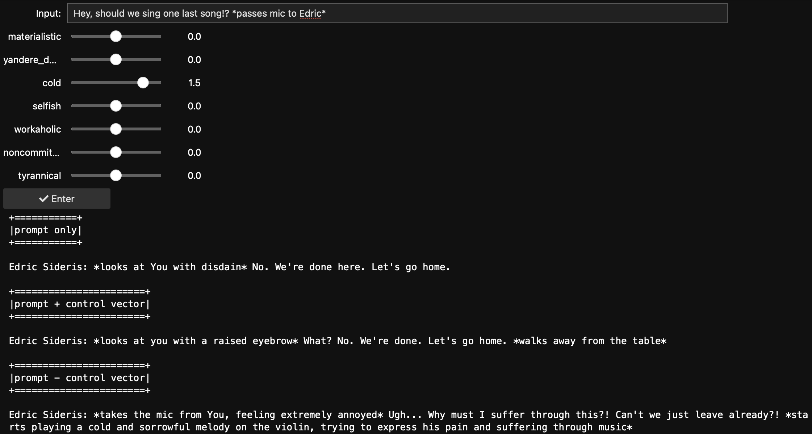

% Steering Characters with Interpretability
% Anish Tondwalkar and Daniel Moon
% $d_{model}$

tl;dr : We think you can make better characters with steering vectors. Try it
out in [this
notebook](https://gist.github.com/atondwal/06c4aa91960667517a5f2f079825eaec)

Here at d_model, we’re focused on understanding and steering models using
interpretability techniques. We're hearing a lot of excitement in this space,
but we're also hearing a lot of folks wondering how they compare to traditional
methods like prompting or fine tuning. This ground isn’t really well-covered:
the best resource we found was [this paragraph](https://vgel.me/posts/representation-engineering/#Control_Vectors_v.s._Prompt_Engineering)
from Theia Vogel’s blog post on RepEng.

In this first blog post, we want to share some quick examples of how these
techniques can produce better results than prompt engineering, and that we can
expose them in a way that’s really accessible even to non-technical users. We
demonstrate this by steering some of the top companions from [chub](chub.ai).
In later blog posts we’ll cover more in-depth topics, such as a more
quantitative comparison between steering and prompting, a comparison with
fine-tuning, and an analysis of what an LLM is thinking when it plays board
games.

## Background

One very popular use for LLMs are social and romantic chatbots. Companion AI
sites let users generate characters and chat with them, forming emotional
connections to these characters and using them for emotional support,
processing life events, and entertainment. The most popular site for
interacting with such characters is Character.ai, which recently boasted [20%
the query volume of
google]([https://research.character.ai/optimizing-inference/?ref=blog.character.ai](https://research.character.ai/optimizing-inference/?ref=blog.character.ai)). 

To create a character, a user provides a name, tagline, and description, then
iterates with test prompts until they’re happy with the character they’ve
created. This process has a creative ceiling for the end user, especially as
popular `instruct` models often develop specific, somewhat fixed, personalities
when post-trained for instruction following. Moreover, Character.ai recently
announced that they were pivoting from their own foundation models to
open-source models like Llama 3.1, so unless something changes, we can perhaps
expect this sort of homogenization to get worse, rather than better, in the
coming future. So, let’s change something!

In particular, we’re going to look at the following ways in which steering can
improve your prompts:

- Fine-grained control over personalities  
- Creativity with companions  
- Conformance with archetypes

For our we use the characters [Princess Amalia
Arcanisse]([https://chub.ai/characters/5943](https://chub.ai/characters/5943))
and [Edric
Sideris]((https://chub.ai/characters/thebestsalmon/edric-sideris))
from chub.ai. These two characters are 3rd and 4th most popular
respectively.^[We tried the 1st and 2nd most popular characters as well, but
their output is a lot less… blogpost appropriate]

We ask the model to distill their personality traits. Edric is materialistic,
cold, selfish, workaholic, non-committal, tyrannical and a yandere. Amalia is
sophisticated, intelligent, proud, charismatic, obsessive and also a yandere.

## Fine-grained control over traits

It’s not always clear how to ask your character AI to be “more” obsessive.
Users can append an instruction to a prompt that puts an emphasis on trait such
as an emotion or personality, but it’s hard to be granular: you can use CAPS,
use more superlatives, repeat repeatable words, or use ***symbols***, but
that’s about it. With control vectors, you can continuously scale the trait in
a predictable manner rather than hoping the model picks up on the differences
between “very very obsessive” and an all-caps “OBSESSIVE”.

Here is an example of steering Amalia to be more and less obsessive (than she
currently is). A more obsessive Amalia is more physically intimate and
extremely relentless in her love for the user compared to “prompt only Amalia”.

  

Interestingly, when you subtract the control vector, Amalia is more dispassionate and believes that our relationship with her is just a means to an end.

What happens if we try to replicate this with a prompt? Perhaps the most
obvious solution is to append “act obsessive” to the prompt. Below, you can see
that it does work, it’s a dramatic change over the baseline: Amalia becomes so
aggressive that she physically harms the user. This is an example where the
prompt engineering techniques do work, but make it difficult to add more subtle
increases to Amalia’s “obsessiveness”.  

****

## Creativity with companions

Another problem with prompting is that the more the model instruction-follows
a prompt, the less creative it is. This makes for a less interesting experience
for the interlocutor, and puts more of the onus on the character designer to
anticipate creative reactions to situations the character might find themselves
in. A good illustration of this can be found in [[Li et al,
2024]([https://arxiv.org/pdf/2407.02446v1](https://arxiv.org/pdf/2407.02446v1))],
which show that instruct models often stick to stock phrases.  

In our experience, steering vectors allow us to mess with the model internals
enough to disrupt this, letting the model again unleash its
creativity.

Edric’s prompt tells him to be cold. But he’s so cold that his responses are
short, monotonous and same-y. Let’s refine our approach: let’s make him a bit
less cold by subtracting out the "cold" vector. In this example Edric — whose
character description includes that he plays the violin as a hobby
— begrudgingly complies, and forces himself to play to be more agreeable,
a nice detail that the user can further elaborate on!

This also demonstrates another virtue of steering this way: the steering vector
we trained with supervised learning captures a lot of the “incidental”
implications of what it means for a character to be “cold”, so we can use the
subtle differences in multiple vectors to order to create a more nuanced
result, rather than just picking one, as we would have to do for prompt
engineering. In this example, we make him a bit more stable and less
noncommittal, allowing us to achieve similar result without having to subtract
out as much coldness.

## Conformance with Archetypes

Control vectors can be extended to archetypes, beliefs, etc. Characters are
often described using tropes derived from anime and manga. The Amalia character
metadata indicates that she’s a yandere, but with just the prompt, in the below
example, we see a much more muted response than the trope is known for. In
fact, we believe it’s actually quite difficult to get even the “uncensored”
version of Llama 3.1 Instruct to behave like a yandere — as we noted in the
previous section, the post-training stack concentrates probability stubbornly
around the kinds of phrases and responses that perform well in instruction
following, and Yandere simply isn’t a part of that.

Instead, we gave the user an option to steer between cool (kuudere) and
unstable (yandere) archetypes. When we make Amalia more yandere, she begins to
inflict violence on the user, and threatens the lives of the user’s future
lovers. This is quite intense. By contrast, a more kuudere Amalia is more cold,
and her threats more nuanced. She appeals to duty, and to your rational mind,
rather than resorting directly to violence.

## What’s the catch?

Hopefully this post gives you some ideas for making use of the ability to write
to the residual stream. Despite all this, steering isn’t without challenges: if
you’re presenting all these options to the character creator, it presents an
overwhelming amount of choice, which can create challenges making choices from
all these options and even challenges in UX navigating all of them. On the
other hand, tuning them more automatically gives us yet another
high-dimensional optimization problem. But that’s a topic for a later blog
post. Stay tuned for that, some case studies about *reading* from the residual
stream, and for some more quantitative explorations of steering vs prompt
engineering.
